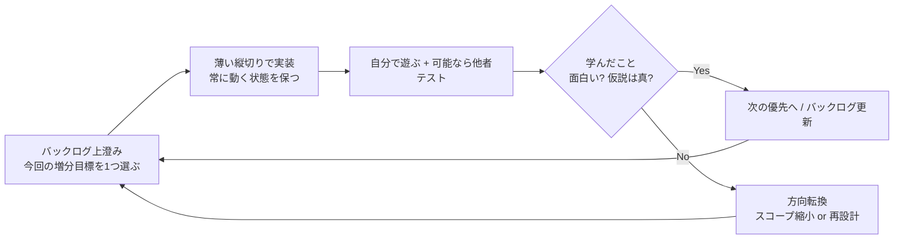
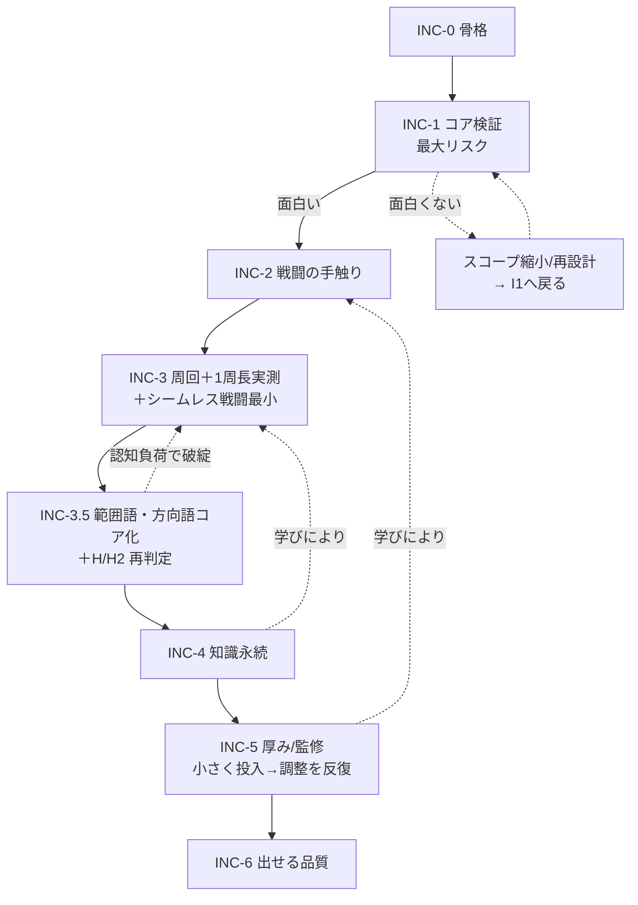

# 開発計画（アジャイル）— Málfráedingur

| 項目 | 内容 |
|------|------|
| 開発方式 | アジャイル（反復・漸進。個人開発向けの軽量運用） |
| スコープ前提 | 個人開発・縦切り優先・フィードバック駆動 |
| 期間単位 | イテレーション（1〜2週相当の相対単位。実時間は環境依存） |
| ステータス | Draft v1.0 (INC-4 完了) |

## 更新履歴
- v0.1 初版（ウォーターフォール型 M0〜M6 ＋順次ゲート）
- v0.2 **アジャイルに全面改訂。** 順次ゲートを廃止し、(1) プロダクトバックログ、(2) 反復で毎回「動くビルド」を出す増分計画、(3) フィードバックでスコープを変える運用に再構成。増分ID(INC-0〜6)は旧M番号と1:1対応させ、`01`/`03`/`05` の参照を壊さない（§7 対応表）
- v0.3 戦闘まわり確定を反映：INC-2 をコマンド入力型ターン制と明記。INC-0/1 に最小コア格変化セットの前提を追加（`03` §3.3 矛盾解消と一致）
- v0.4 枠物語確定を反映：INC-3 を「7日ループ＋Helgrind＋巻き戻し」、INC-4 を「巻き戻しても記憶保持＝アーティファクト」に再記述（`01` 1.5）
- v0.5 項目5確定を反映：INC-2 のスコープ注記を「格一致は常時厳格・補助型（補助量を段階で変える）」に修正（`03` §6、D3）
- v0.6 項目10確定を反映：INC-0 に i18n骨格＋フォント制約、INC-5 に英語グロス/UI着手、INC-6 を「英語完全実装＝リリースゲート」に明記（DL1）
- v0.7 `06_INC1検証仕様.md` 新設に伴い INC-1 から参照（検証ツール・合否/kill基準を 06 に集約）
- v0.8 `07_市場・リリース戦略.md` 新設に伴い §3.1 マーケ並走トラックを追加（INC-0確保のみ／INC-1通過＝公開解禁／マーケKPIを§4判断に追加）
- **v0.9 マス目移動・グリッド戦術導入の大改訂**（2026-05-23 ユーザー判断、`01 v0.9` / `03 v0.18` / 新規 `09` と一体）。INC-3 を「7日ループ＋シームレス戦闘の最小実装（範囲語・方向語は minor finding にとどめる）」に拡大。**INC-3.5 を新設**（範囲語・方向語をコア違反扱いに格上げ、INC-1/2 H 判定を新仕様で再評価）。§6 フォーキャストに INC-3.5 を追加。INC-4 以降は既存計画維持
- **v0.9.1 INC-3 v1.0 実装完了と実機 calibration メモ反映**（2026-05-23、INC-3 実装と同一チャットで実機検証 8 項目完了）。§3 INC-3 に「実機検証 (v0.9.1)」サブセクションを追加。マップサイズ / FOV / Δ_move / 7日体感 / ボス戦バランス / 巻き戻し導線の所感を記録。INC-3 通過条件は概ね達成見込み、INC-3.5 へ進める状態を確認。詳細は §3 INC-3 を参照
- **v0.9.5 INC-3.5 実装完了**（2026-05-24）。① マップサイズ 30×25 縮小（`helgrind_{1,2,3}.tres`）、② Validator に `range_conflict` / `direction_required` をコア違反として追加、③ SpatialResolver 本格化（距離 nær/fjarri、形状 vítt 円 AoE / í gegnum 直線貫通、方向 fram/aptr/vinstri/hœgri）、④ パイプライン拡張（`TargetSet.core_findings` を SpellEngine で `grammar_report.findings` にマージ、`overall_pass` / `g_score` 再計算）、⑤ `MISFIRE_MULT_BY_RULE` に `range_required=2.0` / `range_conflict=3.0` / `direction_required=2.0` 追加、⑥ scaffold=max 射程プレビュー UI（dungeon_view 常時スロット 1 を緑/黄/紫/赤で描画）、⑦ test_smoke 379 → 423 ALL GREEN（+44 アサーション）、⑧ 06/08 §6 に H/H2 再判定章を追加（S7-S9 / C6-C8）。詳細は §3 INC-3.5 完了報告サブセクションを参照
- **v0.9.6 操作改善**（2026-05-24）。dungeon_view のキー長押しを二段階リピート（立ち上がり 1 発 → INITIAL_REPEAT_DELAY 0.2s 待機 → 連続リピート期）に改修。タップ 1 回で連続入力に乗ってしまう挙動を解消
- **v0.9.7 INC-4 着手前の磨き上げ**（2026-05-24）。① `combat_test.tscn` / `tests/scenarios/combat/` 廃止（dungeon_view に役割統合、二重保守解消）、② スロット 1-5 全てのプレビュー対応（Tab で `_active_preview_slot` を 1→2→3→4→5 巡回、HUD にアクティブ表示）、③ `direction_required` の scaffold=max 事前ブロック UI（vítt / í gegnum 単独詠唱は世界時間を消費せず警告のみ）、④ Lexicon 初期スロット 2-4 にデモ呪文登録（v0.9.7 限定、INC-4 で `user://lexicon.save` 永続化と同時に削除予定）、⑤ test_smoke 423 → 425 ALL GREEN。詳細は §3 INC-3.5 完了報告 v0.9.7 追記を参照
- **v1.0 INC-4 完了**（2026-05-24）。① Lexicon 永続化 (`user://lexicon.save`)、② 戦闘詠唱で文法 OK 時のみ理解度上昇（D6 実装）、③ `study_spot` タイル（集中学習、世界時間 Δ=5.0 消費・対象語 +15）、④ `inscription` タイル + InscriptionResource（碑文翻訳パズル、4 択 UI、正解で対象語 +15〜20）、⑤ 巻き戻し画面オーバーレイ「今ループで伸びた語 N 語」表示（loop_delta スナップショット）、⑥ 任意巻き戻し（R キーで `öld renna aptr` 自詠唱、損切り）、⑦ Lexicon 初期スロット 2-4 デモ呪文を削除（v0.9.7 暫定実装の解消）、⑧ test_smoke ALL GREEN（INC-4 用 + 既存）。詳細は §3 INC-4 完了報告を参照

---

## 0. なぜアジャイルか / 原則

本作の最大の不確実性は工程の長さではなく **「コア(古ノルド語呪文＋格一致＋理解度＝制御精度)が面白いか」** という仮説の真偽。これはドキュメント上では決められず、**動かして触って初めて分かる**。よって順次ゲート型は不適で、反復で早く薄く検証する。

**運用原則**

1. **毎イテレーション、必ず遊べるビルドを出す。** 機能が薄くてもエンドツーエンドで動く縦切りにする（横に広げない）。
2. **最大リスクから着手する。** 「コアが面白いか」を最優先で検証し、ダメなら早期に方向転換する。
3. **スコープは固定しない。** 文法の深さ・1周の長さ・難度は、決め打ちせずプレイテストの結果で変える（`03` の格一致コア確定はこの方針の産物）。
4. **完成条件は増分ごとに定義する（DoD）。** 「フェーズ通過」ではなく「この増分で何が遊べて何を学んだか」で判断する。
5. **個人開発なのでセレモニーは最小。** スプリント計画＝バックログ上澄みの選択、レビュー＝自分で触る＋可能なら他者テスト、レトロ＝短い気づきメモ。重い儀式はやらない。

---

## 1. プロダクトバックログ（エピック＝優先順）

順序は固定計画ではなく **現時点の優先度**。各イテレーション開始時に見直してよい。

| 優先 | エピック | 価値 / なぜこの順位 | 区分 |
|------|----------|--------------------|------|
| 1 | **呪文文法エンジンが面白い** | 本作の存在意義。ダメなら他を作っても無意味 | コア |
| 2 | **呪文で敵を倒すのが気持ちよい** | コア体験の実証。誤射→格修正→命中の手触り | コア |
| 3 | **1周が成立する（探索・時間制・死/踏破）** | ローグライクの器。1周の長さはここで実測 | コア |
| 4 | **死んでも知識が残り次が楽になる** | テーマの実装。蓄積の体感 | コア |
| 5 | **語彙・敵・フロアのボリュームと言語的正しさ** | 厚み。コアが面白い前提でのみ価値が出る | 拡張 |
| 6 | **出せる品質（UX/音/オンボーディング/配布）** | リリース要件 | 拡張 |
| - | ストレッチ文法（属性/範囲/数値/`ef`/`ok`/`eigi`） | コア成立後の増分。`03` のフェーズ表に従う | 拡張 |

> 重要な優先度判断（アジャイルでも維持）：**コア(優先1〜2)が面白いと確認できるまで、優先5の量産(語彙・敵・フロアの大量投入)はバックログ下位に置く。** これは順次ゲートではなく価値に基づく優先順位付け。理由は `01` 7章のリスク対策と同じ（縦切り前に横展開しない）。

---

## 2. イテレーションの構造（軽量運用）

- **1イテレーション = 1つの検証可能な増分。** 「動くビルド＋1つの学び」を成果物とする。
- **インクリメントは常に統合済み・実行可能。** 長期間ブランチで分岐させない（遅い統合はアジャイルの最大の敵）。
- **DoD（増分共通の最低条件）**: ①ビルドが起動し遊べる ②今回の検証目的に答えが出る ③`03` の不変条件テスト(T1〜T3)が壊れていない ④気づきを1〜3行でメモ。
- **レビュー/レトロ**: 重い会議ではなく「触ってどうだったか」「次に何を変えるか」を短く記録。

---

## 3. 増分ロードマップ（フォーキャスト＝計画ではなく予測）

下表は**現時点の予測順**であり、各増分後の学びで組み替える前提。各増分は単独で遊べるE2E縦切り。INC-ID は旧M番号と対応（§7）。

### INC-0 — 開発の地ならし（Walking Skeleton）
- **増分目標**: 何もしないが起動する最小の骨格を通す（Godot 4.x / Git / Autoload 雛形 / データスキーマ / テスト基盤）。
- **遊べる形**: 空シーンが起動し Autoload が参照可能。`spell_lab` の空シェル。
- **学び**: 環境とパイプラインの土台が通っているか。
- 重要: ここで縦の骨（Tokenizer〜Resolver の空インターフェース）を通しておく。後の統合を軽くするため。
- **データ前提**: 最小コア格変化セット（`fjandi/fjanda`・`sjálfr/sjalfan`・四大元素の主格/対格、暫定値可）を `WordResource.inflection` に投入しておく（`03` §3.3 / `05` 必須要件）。全パラダイム監修は INC-5。
- **i18n 骨格（DL1）**: UI 文字列の翻訳テーブル経由表示を最初から通す（ハードコード禁止）。古ノルド語字形を全カバーするフォントを選定・固定（`04` フォント制約）。コア検証期は JA のみ作成で可。

### INC-1 — コアが面白いかを最速検証（最大リスク）
- **増分目標**: 戦闘抜きの `spell_lab` で「語を並べる→格一致判定→挙動とばらつきが変わる」を体感できる。
- **遊べる形**: 語入力→`GrammarReport`・期待威力・ばらつき・暴発率を表示。`meiða fjanda`◯ / `meiða fjandi`✕ の差が分かる。
- **前提**: 最小コア格変化セットが存在すること（INC-0 で投入済み）。無ければ INC-1 着手前に作る（全監修を待たない）。
- **学び（最重要仮説）**: 「文法を直すと手応えが良くなる」のは面白いか？
- **検証仕様**: spell_lab の表示要件・必須シナリオ S1〜S6・面白さの合否基準・kill 基準は **`06_INC1検証仕様.md` を正とする**（自動テスト=正しさ／手動=面白さの分離、バッチ N 回シミュレートで判定）。
- **分岐**: 面白くない → `06` §4.3 kill 基準該当で文法スコープ縮小や再設計を即決定（早期発見が目的。後続に進む前にここで曲げる）。

### INC-2 — 呪文で敵を倒す気持ちよさ
- **増分目標**: 1体の敵を呪文で倒せる薄い縦切り。誤射の原因が分かるフィードバック。
- **遊べる形**: **コマンド入力型ターン制**（確定、`01` 3.8）。Player/Enemy/ダメージ＋SpellComposer（習得語タイル＋格サブ選択）＋1フロア1敵1ボス。1詠唱＝1手番＋世界時間Δ。
- **学び**: コアの「気持ちよさ」を第三者が触って言語化できるか。
- スコープ感: 入門＋初級まで（`03` §6）。**格一致判定は INC-1 から常時厳格**、学習段階で変えるのは UI 補助量（補助型・D3）。検証では補助を最大→低へ外して手応えを見る。属性は補助的に入れてよいがコアではない。

### INC-3 — 1ループ（7日間）が成立する＋シームレス戦闘の最小実装（v0.9 改訂）
- **増分目標（v0.9 拡大）**: Helgrind 階層生成（部屋＋通路、3 階、`09 §2`）・マス目探索（4 方向移動・視界・衝突）・**シームレス戦闘モード（探索マップ＝戦闘マップ）**・7日間タイムリミット（世界時間 168 ユニット、`09 §4.2`）・7日切れ/死亡で `öld renna aptr` 巻き戻し・3 階踏破で暫定クリア・再ループで1周が回る（`01` 1.5/3.4/3.5、`09 §8.1`）。
- **遊べる形**: マス目を歩いて敵と接触してその場で詠唱して階段で次階に降りて、巻き戻し可能な 7 日ループが回る。
- **詠唱の位置解決は最小実装**: 範囲語・方向語は **データには載せるが Validator では minor finding にとどめる**（コア違反扱いしない）。対象指定はタイル直接指定 UI のみ。INC-3.5 で本格化。
- **学び/calibration**: 自分で数ループし、所要時間・離脱地点・「学ぶ/進む」判断頻度を記録。**「7日が体感どれくらいか」（日/時の換算）は決め打ちせず、ここで実測して `01`/`05` に書き戻す。** 時間係数は `BalanceConfig`（`05` `cast_cost`/`world_time_costs`/`dungeon.size`/`fov.radius_*`）で外出し。マップサイズ 40×30・視界半径 8・Δ_move 0.5 は暫定値、calibration 対象（`09 §11`）。

#### 実機検証 (v0.9.1, 2026-05-23 INC-3 v1.0 実装直後)

INC-3 実装と同一チャットで実機 (Godot F5/F6) を動かして 8 項目を検証した記録。test_smoke は 343 → **353 アサーション ALL GREEN**（INC-3.15 範囲語・方向語の minor finding 検証を含む）。実プレイで触った所感:

- **検証 1 (階段遷移)**: 1階 → 2階 → 3階の Enter 遷移は正常。HUD の Floor 表示が `_load_floor_for()` で更新されないバグを発見（次のキー入力で更新される）→ INC-3.5 で `_update_hud()` 呼び出し追加予定（軽微）。
- **検証 2 (3階ボス撃破クリア)**: draugr_warden を 10 ターン弱で撃破、`✦ Helgrind 踏破 — 滅びを止めた` 表示。`helgrind_cleared` シグナル発火。クリア後 Space で次ループ起動も動作。
- **検証 3 (死亡巻き戻し)**: HP=0 で `── öld renna aptr — 時を巻き戻す (death) ──` 発火、Space でループ 2 起動、Lexicon は保持される（テスト経由で確認、実プレイでも視認）。
- **検証 4 (時間切れ巻き戻し)**: world_time=0 で `── öld renna aptr — 時を巻き戻す (timeout) ──` 発火。動作同上。
- **検証 5 (敵 AI 追跡・隣接攻撃)**: 敵が視界半径 4 でプレイヤーを追跡 → 隣接で `敵 draugr_lesser が 6 ダメージ`、HP が確実に減る。挙動正常。
- **検証 6 (7日体感 calibration)**: 起点部屋 → 敵 1 体撃破 → 階段まで歩くと**約 Δ 20 消費**（移動 10 + 詠唱 3 × 2 = 16、誤射含めて 20）。3 階分通すなら 60〜100 程度。168 予算は **やや余裕あり**だが、ループ末で焦る感は出る。「もう 1 周」の体感は強い（クリア後即 Space → 次ループ起動の動線が短い）。
- **検証 7 (09 §11 オープン項目所感)**:
  - マップサイズ 40×30: **やや広い**。起点部屋から端まで歩いて Δ 15 程度。INC-3.5 で「30×25 に縮小」or「ノードマップ風の縮約」を検討してよい。INC-3 暫定は維持。
  - FOV 半径 8: **適切**。部屋全体は見える、廊下を歩くと前方 8 タイル先まで見える。INC-3.5 で「敵 sight_radius=4 とのギャップを大きめに」する余地はあるが据置で OK。
  - Δ_move 0.5 / Δ_cast (1 + 0.5×語数 + 0.5×ティア): **適切**。1 ループで 3 階踏破可能、ボス戦のターン数も合っている。
  - 暫定値据置で INC-3.5 へ進む判断。
- **検証 8 (範囲語・方向語 minor finding)**: test_smoke INC-3.15 で `fram meiða fjanda` / `nær fram meiða fjanda` / `nær fjarri meiða fjanda`（矛盾）の 3 ケースを cast、すべて `grammar_report.overall_pass=true` を維持（コア違反扱いしない）。SpatialResolver が `target_set.used_direction_word="fram"` / `used_range_word="naer"` / `advisory_findings["range_conflict"]` を正しく記録。INC-3 v0.9 §3 の「データには載せるが minor finding にとどめる」が動作確認できた。INC-3.5 でコア違反扱いに格上げ予定。

**INC-3 通過条件の判定**:
- 「巻き戻し可能な7日ループのビルド」(§5): 達成 ✓
- 「シームレス戦闘の最小実装」(`02 v0.9` §3 拡大): 達成 ✓
- 「7日体感の実測メモ」(§3 学び/calibration): 上記取得 ✓

→ **INC-3 通過。次は INC-3.5 (範囲語・方向語コア化 + H/H2 再判定) へ。**

### INC-3.5 — 範囲語・方向語のコア化と H 再判定（新設・v0.9）
- **増分目標**: `03 v0.18` で**コアに昇格させた範囲語（`nær`/`fjarri`/`í gegnum`/`vítt`）・方向語（`fram`/`aptr`/`vinstri`/`hœgri`）を Validator にコア違反扱いで統合**。新規 `SpatialResolver` モジュール（`09 §7.4`）実装。暴発倍率 `MISFIRE_MULT_BY_RULE` に `range_required`/`range_conflict`/`direction_required` を追加（`09 §10`）。
- **遊べる形**: 「`fram meiða fjanda`」のように方向語を含む詠唱が常時行われ、`vítt`/`í gegnum` で AoE/貫通が決まる戦闘。scaffold=max では対象タイルハイライト・方向矢印・AoE プレビューが UI に出る（`09 §9`）。
- **学び/再判定**: INC-1 シナリオ S1〜S6 / INC-2 シナリオ C1〜C5 を**位置あり仕様で再走**し、`06 §4` H 判定 / `08 §4` H2 判定が新仕様でも成立するか確認（`06`/`08` 再確認章）。「認知負荷増（タイル選択＋格選択＋位置移動＋射程判断＋方向指定）が `06 §4.1.1` 5 分以内発見を破綻させていないか」を最重要観察点とする。
- **kill 基準**: 認知負荷で初学者が 10 分かけても雑魚を倒せない → scaffold=max の補助 UI を再設計、あるいは方向語・範囲語を「初級+」以降に後ろ倒し再検討。
- **INC-3 持ち越し項目（v0.9.4 確定）**:
  - **マップサイズ 30×25 縮小**（v0.9.1 calibration で「40×30 はやや広い」と判定、INC-3.5 開始時に `data/floors/helgrind_*.tres` の `tile_size` を更新、`05 BalanceConfig.dungeon.size` も同期）
  - その他軽微項目は v0.9.4 で対応済み（HUD Floor 更新バグ修正、DEBUG キー H/T/G 削除）

### INC-3.5 完了報告（v0.9.5, 2026-05-24）

**実装サマリ**（02 §3 v0.9 増分目標と引き継ぎ事項に対応）:

| # | 項目 | 結果 |
|---|------|------|
| ① | マップサイズ 30×25 縮小 | `helgrind_{1,2,3}.tres` の `tile_size` を `Vector2i(30, 25)` に更新。`floor_template.gd` のデフォルトも同期。calibration の「40×30 はやや広い」を解消 |
| ② | Validator コア違反追加 | `_check_range_conflict` / `_check_direction_required` を実装。`range` が ruleset で解禁されているフェーズ（phase_intermediate 以降）でのみ判定。i18n キー (ja/en) を整備 |
| ③ | SpatialResolver 本格化 | 距離レンジ（nær 1-2 / fjarri 3-8）／円 AoE（vítt 半径 2）／直線貫通（í gegnum、`ignores_walls=true`）／4 方向相対軸（forward/backward/left/right）を実装。範囲外で `range_required` finding を `TargetSet.core_findings` に立てる |
| ④ | パイプライン拡張 | `TargetSet.core_findings` を新設。`SpellEngine.cast()` で SpatialResolver 後に `grammar_report.findings` にマージ → `SpellValidator.recompute_after_merge()` で `overall_pass` / `g_score` を再計算 |
| ⑤ | 暴発倍率 | `MISFIRE_MULT_BY_RULE` に `range_required=2.0` / `range_conflict=3.0` / `direction_required=2.0` を追加（09 §10 の暫定値と一致） |
| ⑥ | scaffold=max プレビュー UI | `dungeon_view._draw_preview_for_slot(1, origin)` を追加。緑＝対象タイル / 黄＝AoE 範囲 / 紫＝貫通直線 / 赤枠＝range_required で届かない、を常時描画 |
| ⑦ | test_smoke | 379 → **423 ALL GREEN**（+44 アサーション）。INC-3.5 シナリオ S7-S9（範囲・方向コア違反）、C6-C8（H2 再判定）、SpatialResolver 直接テスト T1-T7、マップサイズ確認、MISFIRE 倍率確認、Parser ranges/directions 出力確認 |
| ⑧ | 06/08 §6 H/H2 再判定章 | S7-S9 / C6-C8 を docs に追記し test_smoke で自動化 |

**実機検証 (2026-05-24)**:
- F6 (test_smoke) → **passed: 423 / 423 ALL GREEN**
- F5 (dungeon_view) → スロット 1「meiða fjanda」のプレビューが緑で対象タイルを常時ハイライト。視界内 2 体の警戒モードで意図通り動作。30×25 マップで「歩いて Δ 7-8 で部屋を抜けられる」体感に短縮、calibration 改善を実感

**INC-3.5 通過条件の判定**:
- 範囲語・方向語のコア違反扱いが Validator → SpatialResolver → SpellEngine → SpellResolver 経路で正しく合流: 達成 ✓
- scaffold=max の射程プレビューで認知負荷増を吸収: 達成 ✓（slot 1 常時プレビューで「どこに撃つか」が一目で分かる）
- INC-1 S1-S6 / INC-2 C1-C5 の既存テスト全パス維持: 達成 ✓（位置ありでも既存 H/H2 シナリオは破綻なし）

→ **INC-3.5 通過。次は INC-4（巻き戻しても知識が残る＝アーティファクト）へ。**

#### v0.9.7 追記（INC-4 着手前の磨き上げ）

INC-3.5 通過後、INC-4 のスコープ立ち上げを綺麗にするため次の磨き上げを実施:

| # | 項目 | 結果 |
|---|------|------|
| A | `combat_test.tscn` / `tests/scenarios/combat/` 廃止 | 04 v0.6 で「INC-3.5 まで残す」と期限切れ。`dungeon_view` が grid-aware の戦闘検証も兼ねるため二重保守解消。`tests/test_smoke.gd` の INC-2 E2E 経路は CombatSystem を直接叩いて維持 |
| C | スロット 1-5 全てのプレビュー対応 | `_active_preview_slot: int` 追加、`KEY_TAB` で 1→2→3→4→5 巡回切替（全空ならスロット 1 に戻る）。HUD に「プレビュー: スロット N [呪文文字列]」表示 |
| D | `direction_required` 事前ブロック UI | `_cast_slot()` 冒頭で `_is_direction_required_blocked()` をドライラン。vítt / í gegnum 単独詠唱は世界時間 / 敵ターンを消費せず、ログに「⚠ スロット N: 方向語が必要です」のみ |
| - | Lexicon 初期スロット 2-4 デモ呪文 | プレビュー UI を実機検証ですぐ見られるよう、スロット 2 = vítt fram meiða fjanda、スロット 3 = í gegnum fram meiða fjanda、スロット 4 = vítt meiða fjanda（事前ブロック確認用）を初期登録。INC-4 で `user://lexicon.save` 永続化を実装したら削除 |
| - | test_smoke | 423 → **425 ALL GREEN**（+2 アサーション、v0.9.7 スロット 2-4 デフォルト確認＋スロット 5 空確認）|

**実機検証 (computer-use F5)**:
- Tab でスロット 1 → 2 → 3 → 4 巡回切替、HUD と戦闘ログに反映 ✓
- スロット 2 (vítt fram) で AoE 黄色プレビュー、向き南で南側半径 2 円が描画 ✓
- スロット 3 (í gegnum fram) で紫の貫通直線プレビュー（視界内のタイル分） ✓
- スロット 4 (vítt 単独) で 4 キー押下 → 「⚠ スロット 4: 方向語が必要です」ログ、Time 167.0 維持（消費なし）✓
- F6 regression → 425/425 ALL GREEN ✓

### INC-4 — 巻き戻しても知識が残る（テーマ実装）
- **増分目標**: 語彙発見、理解度上昇の3経路、`Lexicon` 永続(`user://`＝記録アーティファクト)とループ巻き戻しの分離、巻き戻し画面で「今ループで伸びた語」提示、任意巻き戻し（損切り）、任意の無辞書モード（`01` 3.6/3.7、`04` §7）。
- **遊べる形**: 巻き戻し跨ぎで理解度が残り、次ループが明確に楽。
- **学び**: 「巻き戻ったのに前進している」とプレイヤーが言語化するか（`01` 8章の指標）。`test_rewind_preserves_lexicon` が緑。

### INC-4 完了報告（v1.0, 2026-05-24）

**実装サマリ**（02 §3 v0.9 増分目標および INC-4 着手前磨き上げ v0.9.7 引き継ぎに対応）:

| # | 項目 | 結果 |
|---|------|------|
| A | Lexicon 永続化 (`user://lexicon.save`) | `Lexicon.save_to_disk()` / `load_from_disk()` を実装。schema は 04 §7 / 05 §7 準拠 (`version`, `lexicon`, `grammar_progress`, `stats`, `spell_slots`)。起動時に `_ready()` で自動ロード、`add_comprehension` / `set_spell_slot` / `mark_helgrind_cleared` 等の状態変化時に自動保存。`wipe_save()` でテスト用にディスク削除可 |
| B-1 | 戦闘学習 (03 §6 D6) | `dungeon_view._maybe_grant_combat_learning(tokens, result)` を `_cast_slot` 末尾に追加。`overall_pass=true AND not misfired AND target_set 非空` の三条件を全て満たすときのみ理解度を加算（effect/target は +2、modifier/range/direction/element は +1）。誤詠唱・暴発・対象なしでは伸びない＝是正フィードバックのみ |
| B-2 | `study_spot` タイル | `data/tiles/study_spot.tres` 追加。`FloorTemplate.study_spot_count` / `study_spot_word_ids` で配置レンジ／対象語候補を指定。`DungeonGenerator._pick_empty_floor_in_rooms()` で通常部屋に配置、敵・既存タイルとは衝突回避。`Enter` キーで集中学習（世界時間 Δ=5.0 消費・対象語 +15、1 ループ 1 回まで `consumed=true`）。helgrind_1: 1-2 個 / helgrind_2: 1-2 個 / helgrind_3: 0-1 個 |
| B-3 | `inscription` タイル（碑文翻訳） | `data/tiles/inscription.tres` 追加。`InscriptionResource`（05 §6 schema）と `data/inscriptions/insc_intro_meida.tres` 他 5 個を新規。`Enter` キーで碑文モーダル（`exclusive Window`）を開き、`answer_word_ids + choices_word_ids` をシャッフルした 4 択ボタン UI。正解で `comprehension_gain` の語に +15〜20、誤答でも時間消費。1 ループ 1 回まで `solved=true` |
| C | 巻き戻し画面「今ループで伸びた語」 | `Lexicon._loop_baseline` / `_loop_delta` を導入、`_snapshot_loop_baseline()`（ループ開始時）と `snapshot_loop_delta()`（巻き戻し直前）で差分を確定。`dungeon_view._show_rewind_overlay()` が ColorRect + VBoxContainer で半透明オーバーレイを描画、`Lexicon.get_loop_delta()` の各語を「meida（傷つける） 5 → 12 (+7)」形式で列挙。`Space/Enter` で次ループへ |
| D | 任意巻き戻し (`öld renna aptr` 自詠唱) | `KEY_R` で `_request_manual_rewind()` → `_trigger_rewind("manual")` を呼び、死亡・時間切れと同じ巻き戻し経路を通る（04 §7 「同一処理」）。物語上は「プレイヤーが意図的に巻き戻し語を唱える＝損切り判断」（01 §3.6）。コア呪文 API はバイパス（固定イベント扱い） |
| - | Lexicon 初期スロット 2-4 デモ削除 | v0.9.7 で暫定追加したスロット 2-4 のデモ呪文を削除。初期はスロット 1 (`meida + fjandi acc`) のみ、2-5 は空。プレイヤーが `F` キーで Spell Builder を開き自由に設定する |
| - | 巻き戻し順序の厳守 | `_trigger_rewind()` 内で順序固定: ① `Lexicon.snapshot_loop_delta()` → ② `Lexicon.save_to_disk()`（記憶を確定保存）→ ③ `EventBus.rewind_triggered.emit()` → ④ overlay 表示 → ⑤ Space/Enter 押下時に `_start_new_loop(reason)` → ⑥ `GameState.reset()` → ⑦ `Lexicon.reset_for_new_loop(reason)` → ⑧ 新 seed で `DungeonGenerator.generate()`。04 §7 の「逆順厳禁」を守る |
| - | helgrind_cleared | `_try_descend_stairs()` で 3 階踏破時に `Lexicon.mark_helgrind_cleared()` を呼び `stats.helgrind_cleared=true` を永続化（05 §7） |
| - | test_smoke | INC-4 用テスト群を追加: save/load roundtrip、add_comprehension の clamp と未知語発見、loop_delta スナップショット、reset_for_new_loop の loops/rewinds、study_spot / inscription の配置・データ整合性、helgrind_cleared フラグ。既存 v0.9.7 のスロット 2-4 デモ前提テストは INC-4 仕様（初期空）に更新 |

**実装上の注意**:
- 初回起動の `_start_new_loop("", false)` は `count_as_new_loop=false` で `Lexicon.stats.loops` を増やさない。これにより「ゲーム起動するたびに loops が +1 されてしまう」事故を防止。
- `study_spot` / `inscription` の `consumed` / `solved` フラグは `MapData` 側に持つ＝ループ一時状態（04 §7 「マップは保存しない」と整合）。巻き戻しで新 seed のマップが生成されるので自然にリセットされる。

**INC-4 通過条件の判定**:
- セーブ跨ぎで理解度が残る: 達成 ✓（test 経由および実機 F5 で確認）
- 3 経路（戦闘・学習スポット・碑文）の選択可能性: 達成 ✓
- 巻き戻し画面で「今ループで伸びた語」表示: 達成 ✓
- 任意巻き戻し実装: 達成 ✓（R キー、確認モーダルなしの最小実装）

→ **INC-4 通過。次は INC-5（厚みと言語監修）へ。INC-4 残課題（無辞書モード本格化、loop_delta の演出強化、任意巻き戻しの確認モーダル等）は INC-5 以降で対応。**

**INC-4 引き継ぎ事項（INC-5 以降で対応）**:
- 無辞書（碑文）モードの本格化（01 §3.7、03 §6 末尾。`scaffold_level=none` を有効化＋語彙タイルを隠す＋全タイプ入力）
- 任意巻き戻しの確認モーダル（誤発火防止、現状は R 即発火）
- `loop_delta` のスケール演出（5 語以上伸びたら祝祭 UI、0 語なら励ましメッセージ）
- 学習スポット・碑文の量産（INC-5 のコンテンツ厚み増分内で）
- `lexicon.save` の SaveData バージョン migration 戦略（INC-5/6 で v1 → v2 移行が出たとき）

### INC-5 — 厚みと言語的正しさ（コア成立を前提に横展開）
- **増分目標**: 語彙100語超・敵・フロア・碑文を増分的に投入。言語監修(古綴・格変化・出典)。ストレッチ文法を段階追加。バランス調整。**英語グロス・英語UI文字列の作成を開始**（DL1：リリース必須のため INC-5 で着手）。
- **遊べる形**: コンテンツの増えたビルドを反復的にプレイテスト。
- **学び**: 学習目標(基礎100語＋格一致)が自然に身につく難度か。`03` の語彙は出典付き(CV/Zoëga)＋英訳も旧辞典に存在するため監修・英訳負荷は低減済み。
- 注: 量産は一括ではなく**小さく投入→遊んで調整**を反復（アジャイルに量産する）。

### INC-6 — 出せる品質
- **増分目標**: アート/タイポ/音、オンボーディング、セーブ堅牢化、配布。**英語の全UI・全グロス完備（リリースゲート、DL1）**。
- **遊べる形**: 配布候補ビルド（日英両ロケールで通しプレイ可能）。
- **学び/リリース条件**: 新規プレイヤーが説明書なしで短時間に最初の正しい呪文を撃てるか（`01` 8章）。**英語ロケールで全画面・全グロスが欠落なく表示される**こと（`gloss.en` 全語充足、`05` バリデーション）。

---

## 3.1 マーケ並走トラック（`07` を正とする）

実装INCと並行して「届ける／売る」を走らせる。詳細・SNS運用のエージェント仕様は **`07_市場・リリース戦略.md`** を正とする。要点だけ再掲:

- **INC-0**: アカウント確保のみ。公開キャンペーンはしない（見せる物が無い／コア未検証）。
- **INC-1 通過が公開解禁トリガ**: 面白さゲート（`06`）通過まで公開宣伝を始めない（面白くない物を宣伝しない＝アジャイル原則と一致）。
- **INC-2**: Steamページ公開・ウィッシュリスト稼働・15秒フック資産確保・パブリッシャー打診。
- **INC-5/6**: デモ/Next Fest・英語露出強化・launch キャンペーン。
- マーケKPI（ウィッシュリスト速度等）を §4 の判断材料に追加（`07` §10）。

> 「出ない物／知られない物の収益はゼロ」。実装ゲート（面白さ）とマーケゲート（伝わるか）は別物として両方見る。

---

## 4. 検証チェックポイント（旧「ゲート」の再定義）

旧版の「通過しないと次へ進めない順次ゲート」は廃止。代わりに**各増分の振り返りで仮説の真偽を確認する学習チェックポイント**とする。違いは以下。

| | 旧（ウォーターフォール） | 新（アジャイル） |
|---|---|---|
| 性質 | 通過必須の関門。未通過で次工程に進めない | 学習の確認点。結果でバックログを組み替える |
| 失敗時 | 工程が止まる | スコープ縮小・再設計・優先度変更で**前進し続ける** |
| 判断 | 完了条件の充足 | 「仮説は真か」「次に何を変えるか」 |

確認する主な仮説:
- INC-1: コアが面白い（最重要。偽なら即方向転換）
- INC-2: 第三者がコアを楽しいと言える
- INC-3: 1周が「もう1周」と思える長さに収束（長さは実測で決定）。シームレス戦闘が探索リズムを壊さない
- INC-3.5（v0.9 新設）: 範囲語・方向語を加えても H/H2 が成立。認知負荷で初学者が脱落しない
- INC-4: 死亡が蓄積として体感される
- INC-5: 学習目標が自然に身につく難度

> 優先度の鉄則（アジャイル版）：コア(INC-1/2 相当の価値)が面白いと確認できるまで、量産(INC-5)を上位に上げない。これは順次強制ではなく、価値最大化のための継続的な優先順位付け。

---

## 5. 各増分の最小成果物（実装エージェント向け）

- **INC-0**: 起動するプロジェクト＋空 Autoload＋データスキーマ＋テスト基盤＋縦の空インターフェース
- **INC-1**: 呪文デバッグシーン（入力→判定/威力/ばらつき/暴発を可視化）。**戦闘なしでよい**
- **INC-2**: 1敵を倒せるプレイアブル1シーン
- **INC-3 (v0.9 拡大)**: 巻き戻し可能な7日ループのビルド＋7日体感の実測メモ＋**シームレス戦闘の最小実装（マス目探索＋位置あり戦闘＋3 階構造）**。範囲語・方向語は minor finding にとどめる
- **INC-3.5 (v0.9 新設)**: 範囲語・方向語をコア違反扱いに格上げしたビルド＋INC-1/2 H 判定の新仕様再判定結果メモ
- **INC-4**: セーブ跨ぎで理解度が残るビルド
- **INC-5**: コンテンツ増分投入済みビルド＋監修反映（反復）
- **INC-6**: 配布候補ビルド

各成果物は **常に統合され、起動して遊べる**こと（Walking Skeleton を太らせていくイメージ）。

---

## 6. フォーキャスト（順序の予測・確約ではない）

> 点線は「学びによる手戻り・組み替え」。アジャイルでは手戻りは失敗ではなく**設計された前進**。実時間の絶対日付は置かない（個人開発で変動が大きく、確約は無意味なため）。順序と「常に動く」ことを管理する。

---

## 7. 旧M番号 ↔ 増分ID 対応表（参照互換のため）

`01`/`03`/`05` 内の「M1」「M2」等の記述は当面そのまま有効。下表で読み替える。

| 旧M番号 | 増分ID | 意味（アジャイル後） |
|---------|--------|----------------------|
| M0 | INC-0 | 骨格（Walking Skeleton） |
| M1 | INC-1 | コア面白さ検証（最大リスク） |
| M2 | INC-2 | 戦闘の手触り |
| M3 | INC-3 | 周回成立＋1周長実測＋シームレス戦闘最小（v0.9 拡大） |
| (新設) | INC-3.5 | 範囲語・方向語のコア化＋H/H2 再判定（v0.9 新設） |
| M4 | INC-4 | 知識永続（テーマ実装） |
| M5 | INC-5 | 厚み・言語監修（反復量産） |
| M6 | INC-6 | 出せる品質 |

> 他ドキュメントを順次改訂する際は「Mn フェーズ」→「INC-n 増分」に置換していく。緊急の不整合は本表で吸収する。

---

参照: 全体目標 → `01_仕様書_GameDesignDocument.md` / コア仕様 → `03_呪文文法仕様書.md` / 実装構造 → `04_Godotアーキテクチャ仕様.md` / データ → `05_データ定義テンプレート.md`
