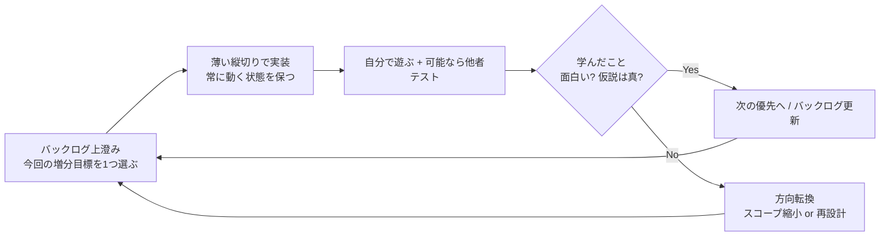
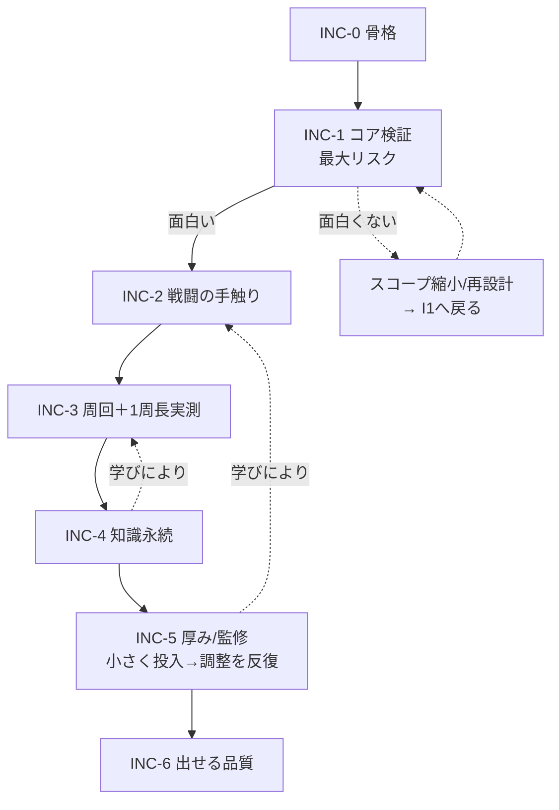

# 開発計画（アジャイル）— Málfráedingur

| 項目 | 内容 |
|------|------|
| 開発方式 | アジャイル（反復・漸進。個人開発向けの軽量運用） |
| スコープ前提 | 個人開発・縦切り優先・フィードバック駆動 |
| 期間単位 | イテレーション（1〜2週相当の相対単位。実時間は環境依存） |
| ステータス | Draft v0.2 |

## 更新履歴
- v0.1 初版（ウォーターフォール型 M0〜M6 ＋順次ゲート）
- v0.2 **アジャイルに全面改訂。** 順次ゲートを廃止し、(1) プロダクトバックログ、(2) 反復で毎回「動くビルド」を出す増分計画、(3) フィードバックでスコープを変える運用に再構成。増分ID(INC-0〜6)は旧M番号と1:1対応させ、`01`/`03`/`05` の参照を壊さない（§7 対応表）
- v0.3 戦闘まわり確定を反映：INC-2 をコマンド入力型ターン制と明記。INC-0/1 に最小コア格変化セットの前提を追加（`03` §3.3 矛盾解消と一致）
- v0.4 枠物語確定を反映：INC-3 を「7日ループ＋Helgrind＋巻き戻し」、INC-4 を「巻き戻しても記憶保持＝アーティファクト」に再記述（`01` 1.5）
- v0.5 項目5確定を反映：INC-2 のスコープ注記を「格一致は常時厳格・補助型（補助量を段階で変える）」に修正（`03` §6、D3）
- v0.6 項目10確定を反映：INC-0 に i18n骨格＋フォント制約、INC-5 に英語グロス/UI着手、INC-6 を「英語完全実装＝リリースゲート」に明記（DL1）
- v0.7 `06_INC1検証仕様.md` 新設に伴い INC-1 から参照（検証ツール・合否/kill基準を 06 に集約）
- v0.8 `07_市場・リリース戦略.md` 新設に伴い §3.1 マーケ並走トラックを追加（INC-0確保のみ／INC-1通過＝公開解禁／マーケKPIを§4判断に追加）

---

## 0. なぜアジャイルか / 原則

本作の最大の不確実性は工程の長さではなく **「コア(古ノルド語呪文＋格一致＋理解度＝制御精度)が面白いか」** という仮説の真偽。これはドキュメント上では決められず、**動かして触って初めて分かる**。よって順次ゲート型は不適で、反復で早く薄く検証する。

**運用原則**

1. **毎イテレーション、必ず遊べるビルドを出す。** 機能が薄くてもエンドツーエンドで動く縦切りにする（横に広げない）。
2. **最大リスクから着手する。** 「コアが面白いか」を最優先で検証し、ダメなら早期に方向転換する。
3. **スコープは固定しない。** 文法の深さ・1周の長さ・難度は、決め打ちせずプレイテストの結果で変える（`03` の格一致コア確定はこの方針の産物）。
4. **完成条件は増分ごとに定義する（DoD）。** 「フェーズ通過」ではなく「この増分で何が遊べて何を学んだか」で判断する。
5. **個人開発なのでセレモニーは最小。** スプリント計画＝バックログ上澄みの選択、レビュー＝自分で触る＋可能なら他者テスト、レトロ＝短い気づきメモ。重い儀式はやらない。

---

## 1. プロダクトバックログ（エピック＝優先順）

順序は固定計画ではなく **現時点の優先度**。各イテレーション開始時に見直してよい。

| 優先 | エピック | 価値 / なぜこの順位 | 区分 |
|------|----------|--------------------|------|
| 1 | **呪文文法エンジンが面白い** | 本作の存在意義。ダメなら他を作っても無意味 | コア |
| 2 | **呪文で敵を倒すのが気持ちよい** | コア体験の実証。誤射→格修正→命中の手触り | コア |
| 3 | **1周が成立する（探索・時間制・死/踏破）** | ローグライクの器。1周の長さはここで実測 | コア |
| 4 | **死んでも知識が残り次が楽になる** | テーマの実装。蓄積の体感 | コア |
| 5 | **語彙・敵・フロアのボリュームと言語的正しさ** | 厚み。コアが面白い前提でのみ価値が出る | 拡張 |
| 6 | **出せる品質（UX/音/オンボーディング/配布）** | リリース要件 | 拡張 |
| - | ストレッチ文法（属性/範囲/数値/`ef`/`ok`/`eigi`） | コア成立後の増分。`03` のフェーズ表に従う | 拡張 |

> 重要な優先度判断（アジャイルでも維持）：**コア(優先1〜2)が面白いと確認できるまで、優先5の量産(語彙・敵・フロアの大量投入)はバックログ下位に置く。** これは順次ゲートではなく価値に基づく優先順位付け。理由は `01` 7章のリスク対策と同じ（縦切り前に横展開しない）。

---

## 2. イテレーションの構造（軽量運用）

- **1イテレーション = 1つの検証可能な増分。** 「動くビルド＋1つの学び」を成果物とする。
- **インクリメントは常に統合済み・実行可能。** 長期間ブランチで分岐させない（遅い統合はアジャイルの最大の敵）。
- **DoD（増分共通の最低条件）**: ①ビルドが起動し遊べる ②今回の検証目的に答えが出る ③`03` の不変条件テスト(T1〜T3)が壊れていない ④気づきを1〜3行でメモ。
- **レビュー/レトロ**: 重い会議ではなく「触ってどうだったか」「次に何を変えるか」を短く記録。

---

## 3. 増分ロードマップ（フォーキャスト＝計画ではなく予測）

下表は**現時点の予測順**であり、各増分後の学びで組み替える前提。各増分は単独で遊べるE2E縦切り。INC-ID は旧M番号と対応（§7）。

### INC-0 — 開発の地ならし（Walking Skeleton）
- **増分目標**: 何もしないが起動する最小の骨格を通す（Godot 4.x / Git / Autoload 雛形 / データスキーマ / テスト基盤）。
- **遊べる形**: 空シーンが起動し Autoload が参照可能。`spell_lab` の空シェル。
- **学び**: 環境とパイプラインの土台が通っているか。
- 重要: ここで縦の骨（Tokenizer〜Resolver の空インターフェース）を通しておく。後の統合を軽くするため。
- **データ前提**: 最小コア格変化セット（`fjandi/fjanda`・`sjálfr/sjalfan`・四大元素の主格/対格、暫定値可）を `WordResource.inflection` に投入しておく（`03` §3.3 / `05` 必須要件）。全パラダイム監修は INC-5。
- **i18n 骨格（DL1）**: UI 文字列の翻訳テーブル経由表示を最初から通す（ハードコード禁止）。古ノルド語字形を全カバーするフォントを選定・固定（`04` フォント制約）。コア検証期は JA のみ作成で可。

### INC-1 — コアが面白いかを最速検証（最大リスク）
- **増分目標**: 戦闘抜きの `spell_lab` で「語を並べる→格一致判定→挙動とばらつきが変わる」を体感できる。
- **遊べる形**: 語入力→`GrammarReport`・期待威力・ばらつき・暴発率を表示。`meiða fjanda`◯ / `meiða fjandi`✕ の差が分かる。
- **前提**: 最小コア格変化セットが存在すること（INC-0 で投入済み）。無ければ INC-1 着手前に作る（全監修を待たない）。
- **学び（最重要仮説）**: 「文法を直すと手応えが良くなる」のは面白いか？
- **検証仕様**: spell_lab の表示要件・必須シナリオ S1〜S6・面白さの合否基準・kill 基準は **`06_INC1検証仕様.md` を正とする**（自動テスト=正しさ／手動=面白さの分離、バッチ N 回シミュレートで判定）。
- **分岐**: 面白くない → `06` §4.3 kill 基準該当で文法スコープ縮小や再設計を即決定（早期発見が目的。後続に進む前にここで曲げる）。

### INC-2 — 呪文で敵を倒す気持ちよさ
- **増分目標**: 1体の敵を呪文で倒せる薄い縦切り。誤射の原因が分かるフィードバック。
- **遊べる形**: **コマンド入力型ターン制**（確定、`01` 3.8）。Player/Enemy/ダメージ＋SpellComposer（習得語タイル＋格サブ選択）＋1フロア1敵1ボス。1詠唱＝1手番＋世界時間Δ。
- **学び**: コアの「気持ちよさ」を第三者が触って言語化できるか。
- スコープ感: 入門＋初級まで（`03` §6）。**格一致判定は INC-1 から常時厳格**、学習段階で変えるのは UI 補助量（補助型・D3）。検証では補助を最大→低へ外して手応えを見る。属性は補助的に入れてよいがコアではない。

### INC-3 — 1ループ（7日間）が成立する（＋7日の体感を実測）
- **増分目標**: Helgrind 階層生成・7日間タイムリミット・7日切れ/死亡で `öld renna aptr` 巻き戻し・踏破でエンディング・再ループで1周が回る（`01` 1.5/3.4/3.5）。
- **遊べる形**: 巻き戻し可能な7日ループ。
- **学び/calibration**: 自分で数ループし、所要時間・離脱地点・「学ぶ/進む」判断頻度を記録。**「7日が体感どれくらいか」（日/時の換算）は決め打ちせず、ここで実測して `01`/`05` に書き戻す。** 時間係数は `BalanceConfig`（`05` `cast_cost`/`world_time_costs`）で外出し。

### INC-4 — 巻き戻しても知識が残る（テーマ実装）
- **増分目標**: 語彙発見、理解度上昇の3経路、`Lexicon` 永続(`user://`＝記録アーティファクト)とループ巻き戻しの分離、巻き戻し画面で「今ループで伸びた語」提示、任意巻き戻し（損切り）、任意の無辞書モード（`01` 3.6/3.7、`04` §7）。
- **遊べる形**: 巻き戻し跨ぎで理解度が残り、次ループが明確に楽。
- **学び**: 「巻き戻ったのに前進している」とプレイヤーが言語化するか（`01` 8章の指標）。`test_rewind_preserves_lexicon` が緑。

### INC-5 — 厚みと言語的正しさ（コア成立を前提に横展開）
- **増分目標**: 語彙100語超・敵・フロア・碑文を増分的に投入。言語監修(古綴・格変化・出典)。ストレッチ文法を段階追加。バランス調整。**英語グロス・英語UI文字列の作成を開始**（DL1：リリース必須のため INC-5 で着手）。
- **遊べる形**: コンテンツの増えたビルドを反復的にプレイテスト。
- **学び**: 学習目標(基礎100語＋格一致)が自然に身につく難度か。`03` の語彙は出典付き(CV/Zoëga)＋英訳も旧辞典に存在するため監修・英訳負荷は低減済み。
- 注: 量産は一括ではなく**小さく投入→遊んで調整**を反復（アジャイルに量産する）。

### INC-6 — 出せる品質
- **増分目標**: アート/タイポ/音、オンボーディング、セーブ堅牢化、配布。**英語の全UI・全グロス完備（リリースゲート、DL1）**。
- **遊べる形**: 配布候補ビルド（日英両ロケールで通しプレイ可能）。
- **学び/リリース条件**: 新規プレイヤーが説明書なしで短時間に最初の正しい呪文を撃てるか（`01` 8章）。**英語ロケールで全画面・全グロスが欠落なく表示される**こと（`gloss.en` 全語充足、`05` バリデーション）。

---

## 3.1 マーケ並走トラック（`07` を正とする）

実装INCと並行して「届ける／売る」を走らせる。詳細・SNS運用のエージェント仕様は **`07_市場・リリース戦略.md`** を正とする。要点だけ再掲:

- **INC-0**: アカウント確保のみ。公開キャンペーンはしない（見せる物が無い／コア未検証）。
- **INC-1 通過が公開解禁トリガ**: 面白さゲート（`06`）通過まで公開宣伝を始めない（面白くない物を宣伝しない＝アジャイル原則と一致）。
- **INC-2**: Steamページ公開・ウィッシュリスト稼働・15秒フック資産確保・パブリッシャー打診。
- **INC-5/6**: デモ/Next Fest・英語露出強化・launch キャンペーン。
- マーケKPI（ウィッシュリスト速度等）を §4 の判断材料に追加（`07` §10）。

> 「出ない物／知られない物の収益はゼロ」。実装ゲート（面白さ）とマーケゲート（伝わるか）は別物として両方見る。

---

## 4. 検証チェックポイント（旧「ゲート」の再定義）

旧版の「通過しないと次へ進めない順次ゲート」は廃止。代わりに**各増分の振り返りで仮説の真偽を確認する学習チェックポイント**とする。違いは以下。

| | 旧（ウォーターフォール） | 新（アジャイル） |
|---|---|---|
| 性質 | 通過必須の関門。未通過で次工程に進めない | 学習の確認点。結果でバックログを組み替える |
| 失敗時 | 工程が止まる | スコープ縮小・再設計・優先度変更で**前進し続ける** |
| 判断 | 完了条件の充足 | 「仮説は真か」「次に何を変えるか」 |

確認する主な仮説:
- INC-1: コアが面白い（最重要。偽なら即方向転換）
- INC-2: 第三者がコアを楽しいと言える
- INC-3: 1周が「もう1周」と思える長さに収束（長さは実測で決定）
- INC-4: 死亡が蓄積として体感される
- INC-5: 学習目標が自然に身につく難度

> 優先度の鉄則（アジャイル版）：コア(INC-1/2 相当の価値)が面白いと確認できるまで、量産(INC-5)を上位に上げない。これは順次強制ではなく、価値最大化のための継続的な優先順位付け。

---

## 5. 各増分の最小成果物（実装エージェント向け）

- **INC-0**: 起動するプロジェクト＋空 Autoload＋データスキーマ＋テスト基盤＋縦の空インターフェース
- **INC-1**: 呪文デバッグシーン（入力→判定/威力/ばらつき/暴発を可視化）。**戦闘なしでよい**
- **INC-2**: 1敵を倒せるプレイアブル1シーン
- **INC-3**: 巻き戻し可能な7日ループのビルド＋7日体感の実測メモ
- **INC-4**: セーブ跨ぎで理解度が残るビルド
- **INC-5**: コンテンツ増分投入済みビルド＋監修反映（反復）
- **INC-6**: 配布候補ビルド

各成果物は **常に統合され、起動して遊べる**こと（Walking Skeleton を太らせていくイメージ）。

---

## 6. フォーキャスト（順序の予測・確約ではない）

> 点線は「学びによる手戻り・組み替え」。アジャイルでは手戻りは失敗ではなく**設計された前進**。実時間の絶対日付は置かない（個人開発で変動が大きく、確約は無意味なため）。順序と「常に動く」ことを管理する。

---

## 7. 旧M番号 ↔ 増分ID 対応表（参照互換のため）

`01`/`03`/`05` 内の「M1」「M2」等の記述は当面そのまま有効。下表で読み替える。

| 旧M番号 | 増分ID | 意味（アジャイル後） |
|---------|--------|----------------------|
| M0 | INC-0 | 骨格（Walking Skeleton） |
| M1 | INC-1 | コア面白さ検証（最大リスク） |
| M2 | INC-2 | 戦闘の手触り |
| M3 | INC-3 | 周回成立＋1周長実測 |
| M4 | INC-4 | 知識永続（テーマ実装） |
| M5 | INC-5 | 厚み・言語監修（反復量産） |
| M6 | INC-6 | 出せる品質 |

> 他ドキュメントを順次改訂する際は「Mn フェーズ」→「INC-n 増分」に置換していく。緊急の不整合は本表で吸収する。

---

参照: 全体目標 → `01_仕様書_GameDesignDocument.md` / コア仕様 → `03_呪文文法仕様書.md` / 実装構造 → `04_Godotアーキテクチャ仕様.md` / データ → `05_データ定義テンプレート.md`
